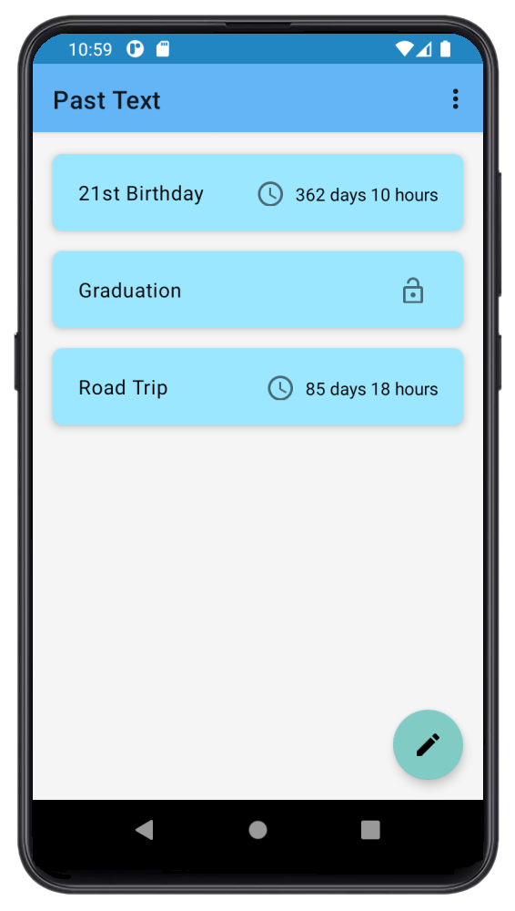
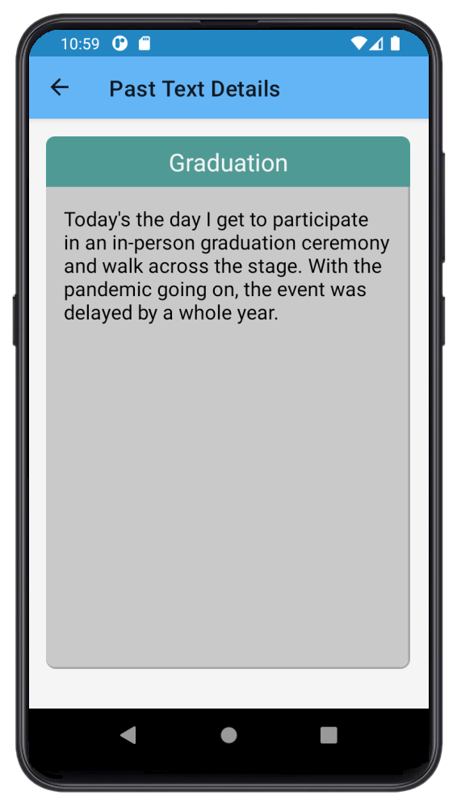

# Past Text

A time capsule Android app to save your moments.

  
  

Thinking of the past brings a sense of nostalgia over those fun days you've had.
With this app, you can write special moments into text and save them for the future.

## Technologies
- Kotlin
- Architecture
  - MVVM (Model - View - ViewModel)
  - Adapter pattern
  - Repository pattern
  - Singleton pattern
- JetPack
  - [LiveData](https://developer.android.com/topic/libraries/architecture/livedata) - observe data to change view content
  - [Room](https://developer.android.com/jetpack/androidx/releases/room) - database for persistence